# Entity-Relationship Diagram (ERD) — Versi Lengkap
**Aplikasi:** Sistem Keagenan & Pembonusan Umroh
**Tanggal Update:** 26 Juni 2026

---

## Diagram ERD

```mermaid
erDiagram
    USERS ||--o{ TRANSACTIONS : "makes"
    USERS ||--o{ COMMISSIONS : receives
    USERS ||--o{ WITHDRAWALS : requests
    USERS ||--o| AGENT_PROFILES : has
    USERS ||--o{ USERS : "referred by"

    MASTER_BANKS ||--o{ AGENT_PROFILES : "selected by"

    UMROH_PACKAGES ||--o{ PACKAGE_DEPARTURES : "has many"
    UMROH_PACKAGES ||--o{ PACKAGE_ROOM_TYPES : "has many"
    UMROH_PACKAGES ||--o{ PACKAGE_ITINERARIES : "has many"
    UMROH_PACKAGES ||--o{ TRANSACTIONS : includes

    PACKAGE_DEPARTURES ||--o{ TRANSACTIONS : "booked on"
    PACKAGE_ROOM_TYPES ||--o{ TRANSACTIONS : "selected as"

    TRANSACTIONS ||--o{ COMMISSIONS : triggers
    COMPANY_BANK_ACCOUNTS ||--o{ TRANSACTIONS : "paid to"

    USERS {
        bigint id PK
        string role "admin, agent, customer"
        string name
        string phone "whatsapp (unique)"
        string email "unique"
        string password
        string referral_code "unique"
        bigint referred_by_id FK
        bool force_password_change "default false"
        timestamp created_at
    }

    MASTER_BANKS {
        bigint id PK
        string bank_code "BCA, BNI, BSI, etc"
        string bank_name
        string logo_url
        string status "active/inactive"
    }

    AGENT_PROFILES {
        bigint id PK
        bigint user_id FK
        bigint bank_id FK
        string bank_account_no
        string account_holder
        string bank_branch
        decimal total_commission
    }

    UMROH_PACKAGES {
        bigint id PK
        string name
        string slug "URL-friendly"
        string travel_type "umroh/haji"
        int travel_duration "hari"
        decimal registration_fee "biaya DP"
        decimal agent_commission "bonus default"
        text perks "JSON array keunggulan"
        text facilities_included
        text facilities_excluded
        text requirements "persyaratan dokumen"
        text terms "syarat dan ketentuan"
        string image_url "cover paket"
        string flyer_url "PDF brosur"
        int quota "total seat"
        int booked "seat terisi"
        bool use_custom_commission
        text commission_config "JSON kustom"
        string status "active/inactive"
        timestamp created_at
    }

    PACKAGE_DEPARTURES {
        bigint id PK
        bigint package_id FK
        date departure_date
        string label "Bebas Tentukan Jadwal"
        int quota_override "opsional override"
    }

    PACKAGE_ROOM_TYPES {
        bigint id PK
        bigint package_id FK
        string room_type "Quad, Triple, Double"
        string description "Sekamar berempat"
        decimal price
    }

    PACKAGE_ITINERARIES {
        bigint id PK
        bigint package_id FK
        int day_number
        string title "Hari Ke-1 KNO MEDAN"
        text description
    }

    COMPANY_BANK_ACCOUNTS {
        bigint id PK
        string bank_name
        string account_number
        string account_holder "PT. NAMA"
        string logo_url
        string status "active/inactive"
    }

    TRANSACTIONS {
        bigint id PK
        string invoice_number
        bigint customer_id FK
        bigint package_id FK
        bigint departure_id FK
        bigint room_type_id FK
        bigint agent_id FK
        bigint company_bank_id FK
        int booking_qty
        decimal unit_price
        decimal total_amount
        decimal transferred_amount
        string payment_proof_url
        string status "pending, waiting, paid, rejected"
        bigint verified_by_id FK
        timestamp verified_at
        timestamp created_at
    }

    COMMISSIONS {
        bigint id PK
        bigint agent_id FK
        bigint transaction_id FK
        decimal amount
        string status "pending, available, withdrawn"
        timestamp created_at
    }

    WITHDRAWALS {
        bigint id PK
        bigint agent_id FK
        decimal amount
        string status "pending, approved, rejected"
        bigint approved_by_id FK
        timestamp requested_at
        timestamp processed_at
    }

    MARKETING_KITS {
        bigint id PK
        string title
        string file_url
        string file_type "brosur, flyer, presentasi"
        bigint uploaded_by_id FK
        timestamp created_at
    }

    GALLERIES {
        bigint id PK
        string title
        string media_type "image, video"
        string media_kind "file, youtube"
        string file_url "path file / embed URL"
        string thumbnail_url
        int sort_order
        timestamp created_at
    }

    TESTIMONIALS {
        bigint id PK
        string name
        string photo_url
        text content
        int rating "1-5"
        bool is_active
        timestamp created_at
    }

    HERO_SLIDERS {
        bigint id PK
        string image_url
        string heading
        string subheading
        string cta_text
        string cta_url
        int sort_order
        bool is_active
    }

    SITE_SETTINGS {
        bigint id PK
        string key "unique"
        text value
    }

    STATIC_PAGES {
        bigint id PK
        string slug "kebijakan-privasi"
        string title
        text content "HTML/Markdown"
        timestamp updated_at
    }

    AGENT_REG_SETTINGS {
        bigint id PK
        decimal dp_amount "Nominal DP"
        text benefits "JSON array keuntungan"
        text bonuses "JSON array hadiah"
        text description
    }

    ABOUT_PAGE {
        bigint id PK
        string image_url
        text description
        string badge_number "10+"
        string badge_label "Tahun Pengalaman"
        text highlights "JSON array keunggulan"
        text legalities "JSON IATA, ASITA, dll"
    }
```

---

## Penjelasan Entitas Baru

### Entitas Paket (Dipecah menjadi Relasi Proper)
| Tabel | Fungsi |
|:------|:-------|
| **PACKAGE_DEPARTURES** | Satu paket bisa punya banyak jadwal keberangkatan (23 Sep, 21 Okt, 25 Nov, "Bebas Tentukan Jadwal"). Admin bisa menambah/hapus jadwal kapan saja. |
| **PACKAGE_ROOM_TYPES** | Satu paket bisa punya banyak tipe kamar (Quad Rp 39.6Jt, Triple Rp 41Jt, Double Rp 43Jt). Harga berbeda per tipe. |
| **PACKAGE_ITINERARIES** | Jadwal perjalanan harian (Day 1: KNO Medan, Day 2: Madinah Rawdah, dst). Admin bisa mengedit deskripsi setiap hari. |

### Entitas Konten Publik (CMS)
| Tabel | Fungsi |
|:------|:-------|
| **GALLERIES** | Menyimpan foto & video (file upload atau embed YouTube) untuk halaman `/gallery`. Admin bisa reorder via `sort_order`. |
| **TESTIMONIALS** | Testimoni jamaah yang ditampilkan di landing page dan halaman `/testimoni`. |
| **HERO_SLIDERS** | Gambar-gambar slider di bagian Hero Section beranda. Admin bisa mengganti heading, subheading, dan tombol CTA. |
| **STATIC_PAGES** | Halaman konten statis (Kebijakan Privasi, Syarat & Ketentuan) yang bisa diedit admin tanpa harus mengubah kode. |

### Entitas Pengaturan Sistem
| Tabel | Fungsi |
|:------|:-------|
| **COMPANY_BANK_ACCOUNTS** | Daftar rekening perusahaan tujuan transfer DP/Pembayaran. Tampil di form pendaftaran agen dan form booking. |
| **SITE_SETTINGS** | Key-value store untuk pengaturan umum: Logo, Favicon, Nomor WA CS, Alamat Kantor, Teks Footer, dll. |
| **AGENT_REG_SETTINGS** | Konfigurasi khusus halaman pendaftaran agen: Nominal DP (Rp 1.000.000), daftar benefit, dan hadiah. |
| **ABOUT_PAGE** | Konten halaman "Tentang Kami": gambar, deskripsi, badge pengalaman, keunggulan, dan legalitas. |
